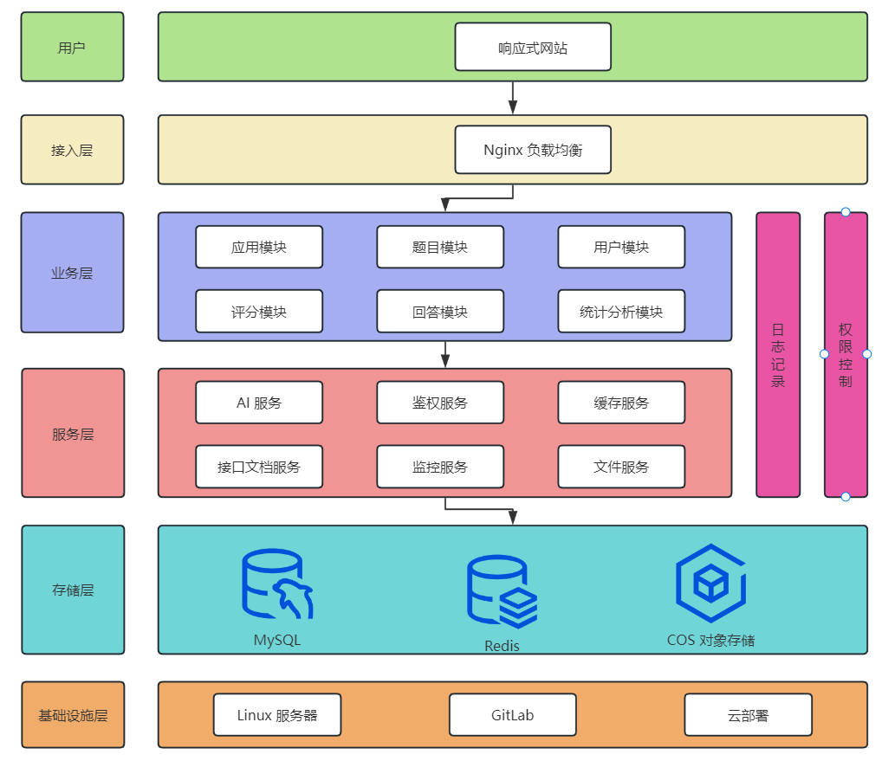
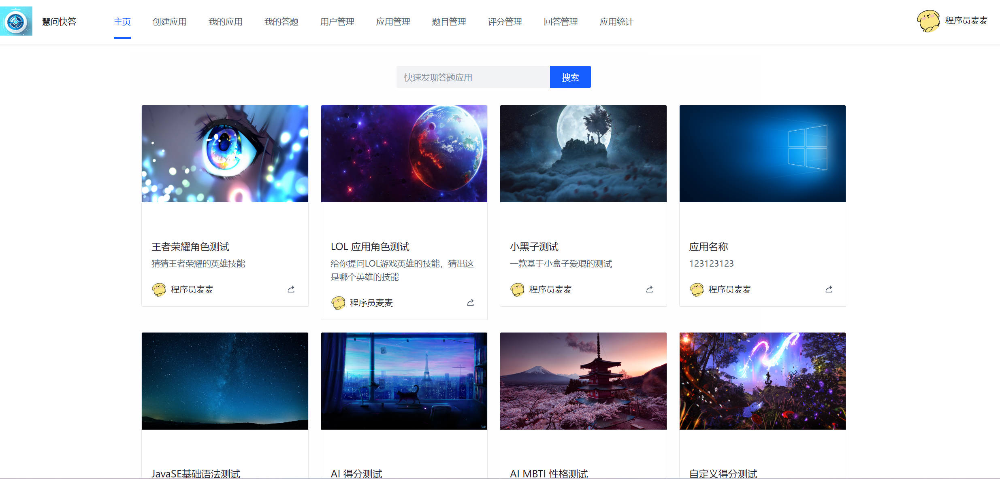
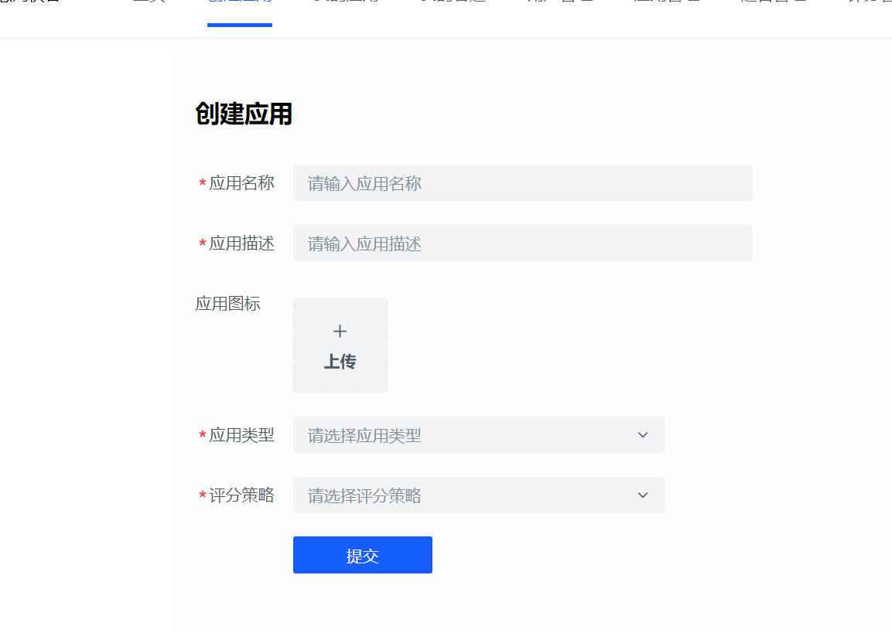
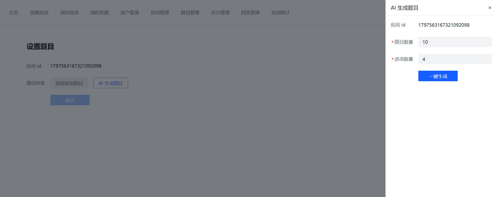

# AI 智能应用平台

> 作者：程序员麦麦

**语雀知识库：https://www.yuque.com/dashboard/books**

基于 SpringBoot + Redis + Caffeine + CharGLM AI + RxJava + SSE + Vue + Arco Design + Pinia 的 AI 智能应用平台。
用户可创建属于自己的应用并基于 AI 快速生成该应用的题目；经管理员审核后，可在主页在线答题并基于多种评分算法或 AI
得到回答总结和得分，并且可以分享应用给其它用户；
管理员还可集中化管理应用、题目、用户、题目答案等信息，并进行相应的统计分析。

## 功能整理

- 用户模块
    - 登录
    - 注册
    - 个人信息修改与查看
    - 修改密码
    - 管理用户 - 增删改查（管理员）
- 应用模块
    - 创建应用（名称、描述、图片、类型）
    - 修改应用
    - 删除应用
    - 查看应用列表
    - 查看应用详情
    - 查看自己创建的应用
    - 审核发布与下架（管理员）
    - 管理应用 - 增删改查（管理员）
    - 应用分享（扫码查看）
- 题目模块
    - 创建题目（包含题目选型得分设置）
    - 修改题目
    - 删除题目
    - 管理题目 - 增删改查（管理员可用）
    - AI 生成题目
- 评分模块
    - 创建评分结果
    - 修改评分结果
    - 删除评分结果
    - 多种评分策略（策略模式）
        - 自定义规则评分 - 测评类
        - 自定义规则评分 - 打分类
        - AI 评分
    - 管理评分结果 - 增删改查（管理员可用）
- 回答模块
    - 提交回答（创建）
    - 查看某次回答的评分结果
    - 查看自己提交的回答列表
    - 管理回答 - 增删改查（管理员可用）
- 统计分析模块
    - 应用评分结果分析和查看

## 技术选型

### 前端

- Vue3
- Pinia 状态管理
- Axios 请求库
- Arco Design 组件库
- 前端工程化 Eslint + Prettier + TypeScript
- 富文本编辑器
- QRCode.js 二维码生成
- OpenAPI 前端代码生成

### 后端

- Spring Boot 2.7.x + Spring MVC
- MyBatis + MyBatis Plus 数据访问（开启分页）
- 存储层：MySQL 数据库 + Redis 缓存 + 腾讯云 COS 对象存储
- Redission 分布式锁
- Caffeine 本地缓存
- 基于 ChatGLM 大模型实现 AI 能力
- RxJava 响应式框架 + 线程池
- SSE 服务推送
- Spring AOP 自定义注解权限 + 记录日志
- 策略模式 + 自定义注解实现多种评分策略
- 多角度优化：性能、幂等性等
- Hutool 工具库 + Apache Commons Lang3 工具类

## 架构设计



## 项目截图




## 快速运行

### MySQL 数据库

1）修改 `application-dev.yml` 的数据库配置为你自己的：

```yml
spring:
  datasource:
    driver-class-name: com.mysql.cj.jdbc.Driver
    url: jdbc:mysql://localhost:3306/maidada
    username: root
    password: 123456
```

2）执行 `sql/create_table.sql` 中的数据库语句，自动创建库表

3）启动项目，访问 `http://localhost:8101/api/doc.html` 即可打开接口文档，不需要写前端就能在线调试接口了~


### Redis 分布式登录

1）修改 `application-dev.yml` 的 Redis 配置为你自己的：

```yml
spring:
  redis:
    database: 1
    host: localhost
    port: 6379
    timeout: 5000
    password: 123456
```

2）修改 `application-dev.yml` 中的 session 存储方式：

```yml
spring:
  session:
    store-type: redis
```

3）移除 `MainApplication` 类开头 `@SpringBootApplication` 注解内的 exclude 参数：

修改前：

```java
@SpringBootApplication(exclude = {RedisAutoConfiguration.class})
```

修改后：

```java
// todo 取消注释开启任务
//@Component
```

### COS 对象存储

1）修改 `application-dev.yml` 的 COS 配置为你自己的：

```yml
cos:
  client:
    accessKey: XXX
    secretKey: XXX
    region: XXX
    bucket: XXX
```

2）找到 constant 目录下的 `FileConstant`

```java
public interface FileConstant {
    /**
     * TODO COS 访问地址 修改为你的
     */
    String COS_HOST = "https://muziteng-1310538376.cos.ap-beijing.myqcloud.com";
}
```

### AI 能力

修改 `application-dev.yml` 的 AI 配置为你自己的：

```yml
ai:
  apiKey: XXX
```

地址：https://maas.aminer.cn/overview
